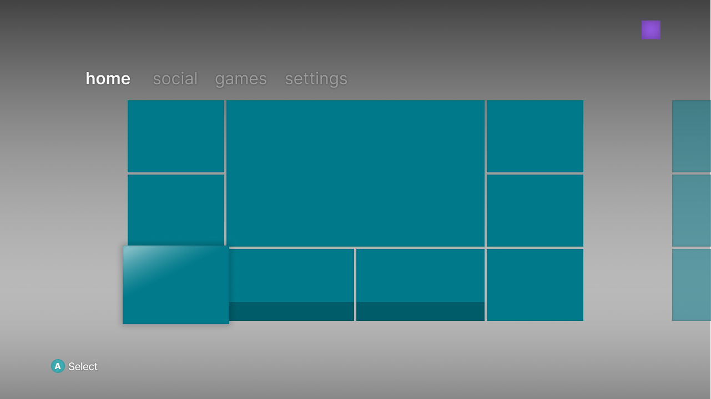

# DashboardPrototype [](./LICENSE)


*Prototype Interface*

## About
This project aims to provide [Xenia](https://xenia.jp) with a more familiar and user friendly interface. Games, Social needs and Settings will all be available through a modern, customisable and gpu-driven interface instead of using configuration files.

## Setup
To get started clone or download the project.
```shell
$ git clone --recursive https://github.com/Michael-Warrick/DashboardPrototype.git
```

## Building
The project uses CMake and is by nature cross-platform, use the steps below to build and run.
```shell
$ cd DashboardPrototype
```
```shell
$ mkdir build && cd build
```
```shell
$ cmake ..
```
```shell
$ cmake --build .
```

## Disclaimer
This project is intended solely for educational and research purposes, and it is made possible through the extensive evaluation of an off-the-shelf Xbox 360 console. The project is not intended to be a commercial product, nor does it seek to replicate or infringe upon Microsoft's proprietary designs, products, or intellectual property. It serves as a technical exploration aimed at advancing understanding of certain concepts and technologies. All Microsoft trademarks and design elements remain the property of Microsoft, and no part of this project should be viewed as an attempt to compete with or replicate their work.

## Resources
- CMake Docs: https://cmake.org/documentation/
- LearnOpenGL.com: https://learnopengl.com/